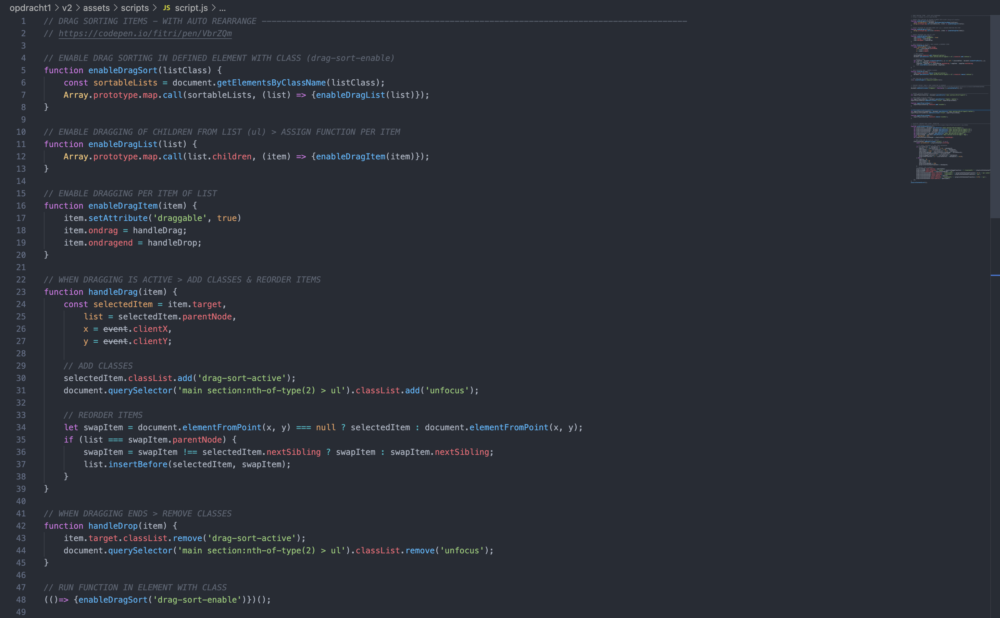
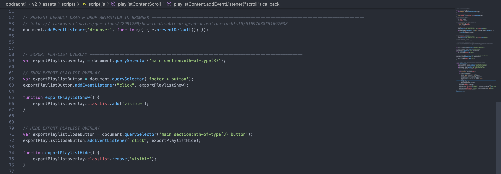
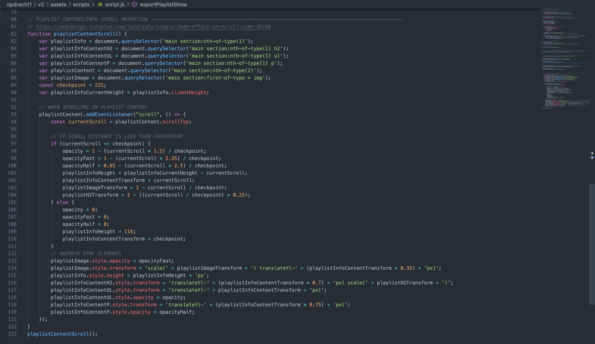

# Frontend voor Designers - opdracht 1: Een Micro-interactie uitwerken en testen

Ontwerp een user interface voor een gegeven use case. Werk je ontwerp uit in HTML, CSS en Javascript om te kunnen testen in een browser.

Lees hier de [opdrachtbeschrijving](./opdrachtbeschrijving.md).

# Quarantine Party lijst
Een kleine opdracht om een afspeellijst te kunnen sorteren door gebruik te maken van drag and drop. 
<ul>
  <li>
    <a href="https://rowin2507.github.io/frontend-voor-designers-2021/opdracht1/v1/" target="_blank">Link naar opdracht (v1)</a>
  </li>
  <li>
    <a href="https://rowin2507.github.io/frontend-voor-designers-2021/opdracht1/v2/" target="_blank">Link naar opdracht (v2)</a>
  </li>
</ul>

Met de eerste versie was ik eigenlijk al behoorlijk tevreden, echter kwam er uit de feedback van klasgenoten naar voren dat op een wat kleiner scherm de playlist informatie (bovenste section) erg veel ruimte in nam en er niet zo veel content over bleef voor de playlist items zelf. Om deze reden heb ik in de tweede versie dan ook een functie gemaakt die tijdens het scrollen deze sectie in laat schuiven om zo meer ruimte te bieden aan de content. Zie de onderstaande afbeeldingen voor een verschil tussen versie 1 en versie 2 indien ze naar beneden zijn gescrolled.

## Interface
Gebruikers kunnen te allen tijde zelf de volgorde aanpassen van de afspeellijst. Zo blijft de gebruiker altjid de controle houden.
Door de pagina op te delen uit twee delen (playlist informatie en playlist content), blijft het overzicht behouden en is het eenvoudig om handelingen uit te voeren. Ik heb hierbij dus de principes "keep users in control" gebruikt en "Strong visual hierarchies work best" heb ik hier ook toegepast. 

De interface heb ik zelf ontworpen en heb ik zo minimalistisch mogelijk proberen vorm te geven om de nadruk te leggen op de content (de afspeellijst zelf dus). Om goed duidelijk te maken welke elementen op moeten vallen, heb ik het contrast hoog gehouden. De achtergrond kleur is zo dus donkerblauw en de Buttons of andere CTA's zijn meer mint kleur of wit.

## Code
In het eerste deel van de code wordt het drag and drop principe mogelijk gemaakt. In de screenshot is per stap beschreven wat er gebeurt. Allereerst wordt het element met de class "drag-sort-enable" gedefinieerd als sorteerbare parent. Elementen binnen deze parent worden per element als sorteerbaar gedefinieerd. Dan wordt er a.d.h.v. de status "ondrag" en "ondragen" een variabele gedefinieerd. Indien een element gesleept wordt, wordt er een class meegegeven en wordt er gekeken naar de huidige positie en wordt er gekeken welke elementen zich in de buurt bevinden en moeten uitwijken indien het element zich voor een groot deel op dezelfde positie bevindt. Deze elementen worden nu omgewisseld of verschoven en de class die werd meegegeven, die wordt nu weer weggehaald.

In het tweede deel wordt het standaard gedrag van het slepen van elementen (het sleepbare element is gefixeerd aan je muis en morphed weer terug naar zn oorspronkelijke positie op de pagina) binnen de browser uitgeschakelt voor de afspeellijst items. Hierdoor voelt het slepen van een element wat logischer aan en ontstaat er geen verwarring over de veranderde positie.
In deze screenshot is ook de functie van de overlay te zien die in beeld komt als je op de exporteerknop klikt onderaan de pagina.

In het laatste deel van de JavaScript code, is te zien hoe de playlist informatie transitie tijdens de scroll wordt aangepast. Deze code maakt de playlist informatie kleiner tot je tot een bepaald punt hebt gescrolld om zo het overzicht te behouden en meer ruimte te geven voor de playlist. Er wordt gekeken naar de huidige scroll positie op de pagina en als je binnen een bepaalde waarde zit, worden er op meerdere elementen een transform en opacity uitgevoerd om zo de content te herpositioneren of onzichtbaar te maken.

## Bronnen
1. https://codepen.io/fitri/pen/VbrZQm
2. https://stackoverflow.com/questions/42991709/how-to-disable-dragend-animation-in-html5/51697038#51697038
3. https://webdesign.tutsplus.com/tutorials/simple-fade-effect-on-scroll--cms-35166
